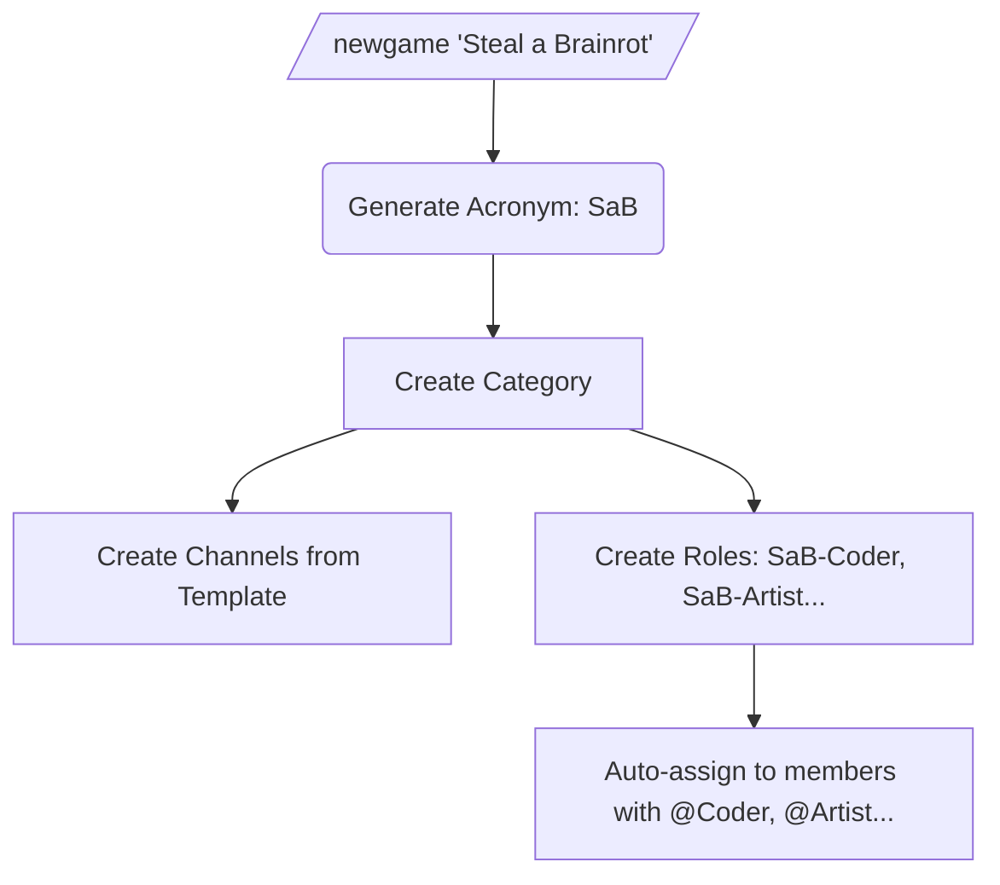

<p align="center">
  
</p>

<h1 align="center">gamedev-bot</h1>

<p align="center">
  discord bot for organizing game dev projects with auto-generated channels, roles, and acronyms.
</p>

<p align="center">
  
  
  
</p>

---

### quickstart

**docker (recommended)**

```bash
git clone https://github.com/microck/gamedev-discord-bot.git
cd gamedev-discord-bot
cp .env.example .env

# edit .env with your DISCORD_TOKEN and GUILD_ID

docker compose up -d
```

**manual**

```bash
pip install -r requirements.txt
python -m bot.main
```

---

### features

organize your game dev discord with zero effort.

- **auto channels:** creates 25+ organized channels per game from a template.
- **smart acronyms:** "Steal a Brainrot" → SaB, "The Great Escape" → TGE.
- **role sync:** members with @Coder auto-get @SaB-Coder for every game.
- **emoji groups:** channels prefixed by category (💻-sab-code-frontend).
- **live templates:** modify template, sync to all existing games instantly.

---

### how it works



1. **create:** run `/newgame "Your Game Name"` - acronym auto-generated.
2. **channels:** 25 channels created from template with emoji prefixes.
3. **roles:** game-specific roles created and auto-assigned to team members.
4. **customize:** add/remove channels per-game or modify the global template.

---

### usage

#### 1. setup

create these member roles in your server (manually):
- `Coder`, `Artist`, `Audio`, `Writer`, `QA`

assign them to your team. the bot handles the rest.

#### 2. create a game

```
/newgame "Steal a Brainrot"
```

creates:

```
📁 Steal a Brainrot
├── 💬-sab-announcements
├── 💬-sab-general
├── 💬-sab-brainstorming
├── 💬-sab-tasks
├── 💻-sab-code-frontend
├── 💻-sab-code-backend
├── 💻-sab-code-gamelogic
├── 💻-sab-code-networking
├── 💻-sab-code-bugs
├── 🎨-sab-design-gui
├── 🎨-sab-design-3d
├── 🎨-sab-design-2d
├── 🎨-sab-design-animation
├── 🎨-sab-design-vfx
├── 🎨-sab-design-concept
├── 🔊-sab-audio-music
├── 🔊-sab-audio-sfx
├── ✍️-sab-writing-story
├── ✍️-sab-writing-dialogue
├── ✍️-sab-writing-copy
├── 🧪-sab-qa-playtesting
├── 🧪-sab-qa-feedback
├── 📚-sab-resources-refs
├── 📚-sab-resources-tools
└── 🎙️-sab-voice
```

roles created: `@SaB-Coder`, `@SaB-Artist`, `@SaB-Audio`, `@SaB-Writer`, `@SaB-QA`

#### 3. manage template

```
/template list              → view current template
/template add <name> <group> → add channel to template
/template remove <name>     → remove from template
/template sync              → sync changes to all games
```

#### 4. per-game customization

```
/game addchannel SaB marketing general    → add custom channel
/game removechannel SaB code-networking   → remove channel
/game list                                → list all games
```

---

### commands

| command | description |
|---------|-------------|
| `/newgame <name> [acronym]` | create game with channels and roles |
| `/deletegame <acronym>` | delete game and all channels/roles |
| `/game list` | list all games |
| `/game addchannel` | add custom channel to a game |
| `/game removechannel` | remove channel from a game |
| `/template list` | show channel template |
| `/template add` | add channel to template |
| `/template remove` | remove from template |
| `/template sync` | sync template to all games |
| `/group list` | list groups and emojis |
| `/group emoji` | change a group's emoji |

---

### channel groups

| group | emoji | channels |
|-------|-------|----------|
| general | 💬 | announcements, general, brainstorming, tasks |
| code | 💻 | frontend, backend, gamelogic, networking, bugs |
| design | 🎨 | gui, 3d, 2d, animation, vfx, concept |
| audio | 🔊 | music, sfx |
| writing | ✍️ | story, dialogue, copy |
| qa | 🧪 | playtesting, feedback |
| resources | 📚 | refs, tools |
| voice | 🎙️ | voice channel |

---

### project structure

```
gamedev-discord-bot/
├── bot/
│   ├── main.py          # bot entry, role sync
│   ├── config.py        # groups, template, env
│   ├── database.py      # sqlite crud
│   ├── models.py        # dataclasses
│   ├── utils.py         # acronym generation
│   └── cogs/
│       ├── games.py     # /newgame, /deletegame, /game
│       └── templates.py # /template, /group
├── data/                # sqlite database
└── dist/                # (if compiled)
```

---

### troubleshooting

**commands not showing**
wait a few minutes for discord to sync, or set `GUILD_ID` in .env for instant sync.

**role sync not working**
enable Server Members Intent in discord developer portal. bot role must be above game roles.

**permission errors**
move bot role higher in server role list. administrator permission recommended.

**acronym conflicts**
if "SaB" exists, new game auto-becomes "SaB2". or specify custom: `/newgame "Name" acronym:XYZ`

---

### license

mit
